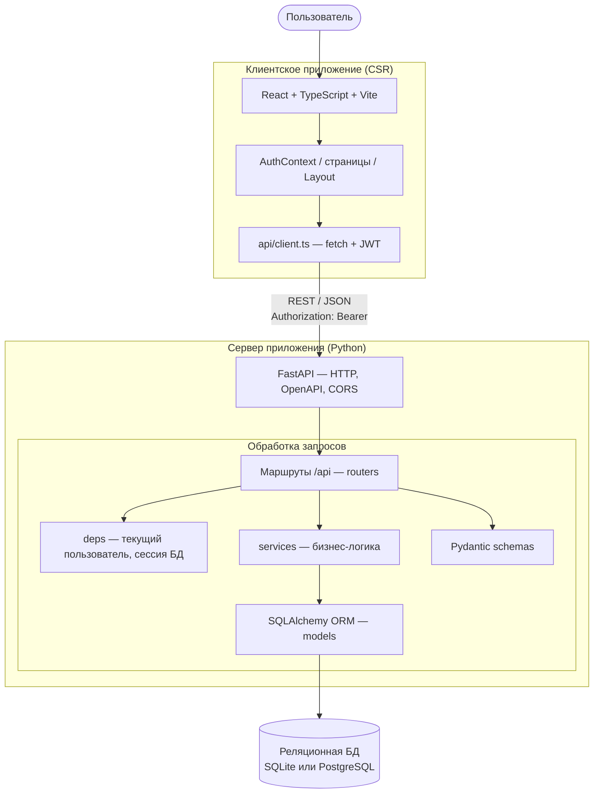
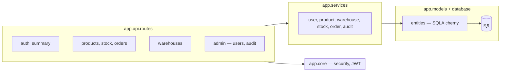
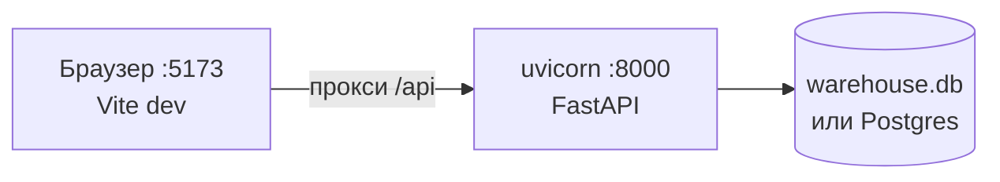
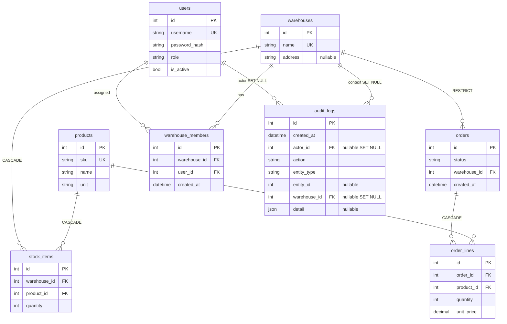
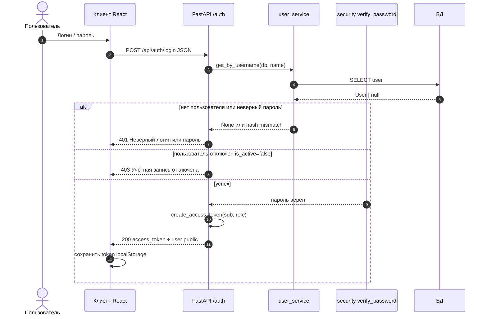

# Платформа «Склад и заказы» — описание и UML-диаграммы

Документ фиксирует назначение веб-приложения, роли, основные сценарии и структуру данных. Диаграммы в формате **Mermaid** (рендер в GitHub, VS Code, Cursor и на [mermaid.live](https://mermaid.live)).

**Стек:** REST API (FastAPI), БД SQLAlchemy (SQLite/PostgreSQL), клиент React + Vite, JWT (Bearer), роли `worker` / `admin`.

---

## 1. Назначение и границы системы

- Учёт **складов**, **товаров**, **остатков** по парам склад–товар, **заказов** со строками и статусами (`draft` → `confirmed` → `fulfilled` / `cancelled`).
- **Администратор** расширяет модель: склады (создание/изменение/удаление), пользователи (создание, отключение, включение, удаление из БД), участники складов, просмотр **журнала аудита**.
- **Рабочий** ведёт операционные сущности без административных мутаций складов и без разделов «Пользователи» и «Журнал».
- Аутентификация: логин/пароль, ответ с JWT; защищённые маршруты требуют заголовок `Authorization: Bearer <token>`.

---

## 2. Архитектура системы

Ниже — **логическая** архитектура (не привязана к конкретному хостингу): один процесс backend, один SPA-фронт, одна реляционная БД.

### 2.1. Контекст: клиент, API, хранилище

**Пояснение:** браузер загружает SPA; все операции с данными идут по **REST** на префикс `/api` (в dev Vite может проксировать на порт uvicorn). **JWT** передаётся в заголовке; роль из токена ограничивает доступ к административным маршрутам. Схема таблиц создаётся при старте приложения (`metadata.create_all`).

### 2.2. Декомпозиция backend по пакетам

### 2.3. Развёртывание (типовой вариант «разработка / demo»)

Для **production** статику `frontend/dist` отдают через nginx/CDN, а API — отдельным процессом; БД — управляемый **PostgreSQL** (см. `docker-compose.postgres.yml`).

---

## 3. Диаграмма вариантов использования

```mermaid
flowchart TB
  subgraph Guests["Вне системы (гость)"]
    G((Гость))
  end

  subgraph SYS["Система «Склад и заказы»"]
    direction TB

    UC_login([Войти / получить JWT])
    UC_health([Проверка /health])

    subgraph UC_worker["Рабочий и админ"]
      UC_summary([Просмотр сводки])
      UC_prod_r([Просмотр товаров])
      UC_prod_w([Создать/изменить/удалить товар])
      UC_wh_r([Просмотр складов])
      UC_stock_r([Просмотр остатков])
      UC_stock_w([Создать/изменить/удалить остаток])
      UC_ord_r([Просмотр заказов])
      UC_ord_c([Создать заказ])
      UC_ord_t([Сменить статус заказа])
      UC_ord_d([Удалить заказ drafts/cancelled])
    end

    subgraph UC_admin["Только администратор"]
      UC_wh_cud([Создать/изменить/удалить склад])
      UC_wh_mem([Назначить/снять участника склада])
      UC_users([Управление пользователями])
      UC_audit([Просмотр журнала аудита])
    end
  end

  G --> UC_login
  G --> UC_health

  W((Рабочий))
  A((Администратор))

  W --> UC_summary
  W --> UC_prod_r
  W --> UC_prod_w
  W --> UC_wh_r
  W --> UC_stock_r
  W --> UC_stock_w
  W --> UC_ord_r
  W --> UC_ord_c
  W --> UC_ord_t
  W --> UC_ord_d

  A --> UC_summary
  A --> UC_prod_r
  A --> UC_prod_w
  A --> UC_wh_r
  A --> UC_stock_r
  A --> UC_stock_w
  A --> UC_ord_r
  A --> UC_ord_c
  A --> UC_ord_t
  A --> UC_ord_d

  A --> UC_wh_cud
  A --> UC_wh_mem
  A --> UC_users
  A --> UC_audit
```

Акторы: **Гость** (до входа), **Рабочий**, **Администратор**. Варианты сгруппированы по областям; помечено `<<extend>>`-логикой там, где сценарий доступен только при наличии токена и роли.

**Пояснения:**

| Вариант | Кто | REST (префикс `/api`) |
|--------|-----|------------------------|
| Вход | Гость | `POST /auth/login` |
| Сводка | Авторизованные | `GET /summary` |
| Товары | Авторизованные | `GET/POST/PATCH/DELETE /products` |
| Склады (чтение) | Авторизованные | `GET /warehouses`, `GET /warehouses/{id}` |
| Склады (изменение) | Админ | `POST/PATCH/DELETE /warehouses` |
| Участники склада | Админ | `GET/POST /warehouses/{id}/members`, `DELETE .../members/{user_id}` |
| Остатки | Авторизованные | `GET/POST/PATCH/DELETE /stock` |
| Заказы | Авторизованные | `GET/POST/DELETE /orders`, `POST /orders/{id}/transition` |
| Пользователи | Админ | `GET/POST /admin/users`, `POST .../deactivate`, `POST .../activate`, `DELETE /admin/users/{id}` |
| Аудит | Админ | `GET /admin/audit-log` |

Журнал аудита пополняется при мутациях (склады, участники, товары, остатки, заказы, пользователи).

---

## 4. ER-диаграмма платформы

Отражены таблицы ORM-модели, ключи и основные связи. Перечислены правила `ON DELETE`, заданные во ForeignKey.

**Бизнес-ограничения (не все отображены на ER):**

- `stock_items`: уникальность пары `(warehouse_id, product_id)`.
- `warehouse_members`: уникальность пары `(warehouse_id, user_id)`.
- Удаление склада при наличии заказов/ограничений — логика сервиса и БД (`RESTRICT` на заказе).

---

## 5. Диаграммы последовательности

### 5.1. Вход пользователя (аутентификация)

---

## 6. Соглашения по просмотру диаграмм

- Локально: расширение «Markdown Preview Mermaid Support» или экспорт PNG с [mermaid.live](https://mermaid.live).
- В репозитории: при просмотре `PLATFORM_UML.md` на GitHub диаграммы отображаются автоматически.

---

## 7. Версия документа

Соответствует коду приложения: FastAPI-приложение `app.main`, модели `app.models.entities`, маршруты `app.api.routes.*`. При изменении API или схемы БД этот файл стоит обновлять.
